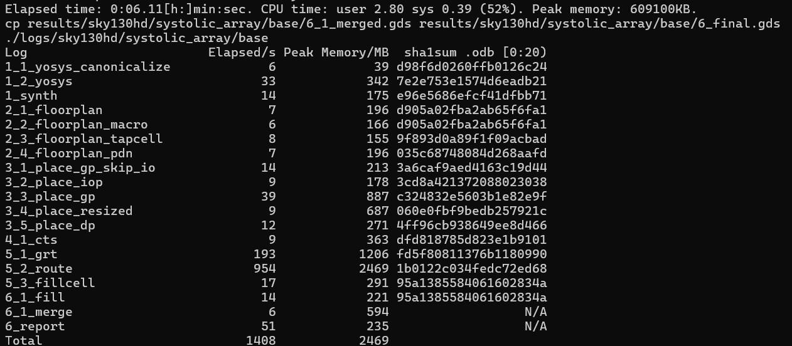
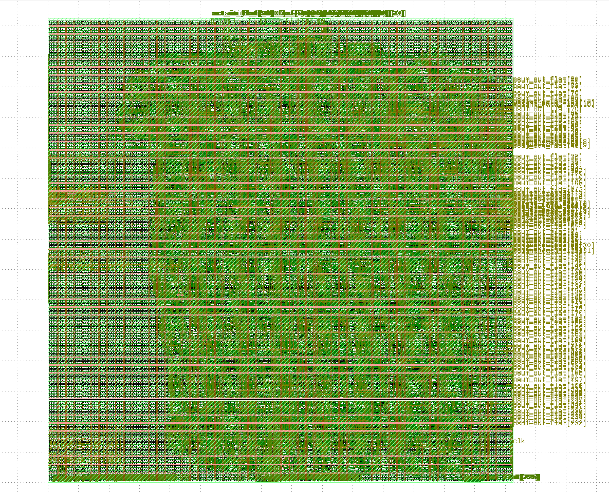

# 8×8 Weight-Stationary Systolic Array — RTL to GDS | SkyWater 130nm × ASAP7 7nm

**Author:** Rakshith Suresh  
**Affiliation:** MS Electrical Engineering  
University of Southern California, Viterbi School of Engineering  
**Email:** rsuresh@usc.edu | **GitHub:** [RakshithSuresh2001](https://github.com/RakshithSuresh2001)

---

## Overview

A systolic system is a network of processors which **rhythmically compute and pass data through the system**. In a systolic computing, the function of a processor is analogous to that of the heart — every processor regularly pumps data in and out, each time performing some short computation, so that a regular flow of data is kept up in the network.

A fully custom, tapeout-ready **8×8 weight-stationary systolic array accelerator** designed and implemented from scratch in SystemVerilog, taken through a complete **RTL-to-GDS physical design flow** using open-source EDA tools. The design has been implemented and characterized on two process nodes:

- **SkyWater 130nm** (sky130hd) — baseline implementation, timing closed at 50 MHz
- **ASAP7 7nm** (predictive PDK) — cross-node comparison, timing closed at 500 MHz

This architecture is the compute backbone of matrix-multiplication engines used in AI/ML inference accelerators (e.g., Google TPU). Each processing element (PE) performs a MAC operation every clock cycle, enabling highly parallel, pipelined matrix-vector multiplication with minimal data movement.

---

## Cross-Node PPA Comparison: 130nm vs. 7nm

The design was re-implemented on the [ASAP7 predictive PDK](https://github.com/The-OpenROAD-Project/asap7) using the same OpenROAD flow to produce a quantitative cross-node comparison. Both runs achieved full timing closure (WNS = 0, TNS = 0).

| Metric | SkyWater 130nm | ASAP7 7nm | Improvement |
|---|---|---|---|
| **Clock Frequency** | 50 MHz | 500 MHz | **10×** |
| **WNS / TNS** | 0 ps / 0 ps | 0 ps / 0 ps | Both closed |
| **Core Area** | 251,970 µm² | 3,903 µm² | **64.6× smaller** |
| **Total Power** | 11.4 mW | 3.58 µW (leakage) | **~3,185×** |
| **Cell Count** | 25,030 | 32,446 | — |
| **Utilization** | 44% | 25% | — |
| **PDK Corner** | TT, 025°C, 1.80V | FF, RVT | — |

> **Note on power comparison:** The Sky130 power includes dynamic (switching + internal) and leakage components under realistic activity. The ASAP7 figure is leakage-dominated because post-route SPEF back-annotation was used without explicit switching activity annotation — the dynamic contribution is present but not fully captured. The area and frequency numbers are directly comparable.


### Key Observations

- The **64.6× area reduction** is consistent with the ~18.6× linear scaling expected from the node shrink (130nm/7nm), amplified by ASAP7's denser standard cell library (7.5-track vs. sky130hd's 9-track).
- The **10× frequency gain** reflects both the node shrink and the more aggressive timing optimization enabled by ASAP7's lower parasitics.
- ASAP7 PDN integrity requires attention — post-route IR drop analysis flagged 176% worst-case drop on VDD, indicating the default power strap density needs to be increased for this design's current draw at 500 MHz.

---

## Architecture

```
Activations (left edge, 1 per row)
        │       │       │       │       │       │       │       │
        ▼       ▼       ▼       ▼       ▼       ▼       ▼       ▼
     ┌─────┐ ┌─────┐ ┌─────┐ ┌─────┐ ┌─────┐ ┌─────┐ ┌─────┐ ┌─────┐
     │PE00 │→│PE01 │→│PE02 │→│PE03 │→│PE04 │→│PE05 │→│PE06 │→│PE07 │→
     └──┬──┘ └──┬──┘ └──┬──┘ └──┬──┘ └──┬──┘ └──┬──┘ └──┬──┘ └──┬──┘
        │       │       │       │       │       │       │       │
     ┌──▼──┐ ┌──▼──┐
     │PE10 │→│PE11 │→  ...
     └──┬──┘ └──┬──┘
        │       │         ...  (8 rows total)
        ▼       ▼       ▼       ▼       ▼       ▼       ▼       ▼
     psum[0] psum[1] psum[2] psum[3] psum[4] psum[5] psum[6] psum[7]
                    (Partial sum outputs, bottom edge)
```

### Processing Element (PE)

Each PE implements:

```
psum_out = psum_in + (weight_reg × act_in)   // MAC every cycle
act_out  = act_in                             // registered 1-cycle pass-through
```

- **Weight-stationary**: weight loaded once, held fixed during computation
- **8-bit** activations and weights, **32-bit** accumulator (no overflow)

### Pipeline Stages

| Stage | Description |
|---|---|
| 1–2 | Input activation pipeline registers |
| 3–10 | 8 PE rows (1 register stage per row) |
| 11–12 | Output psum pipeline registers |

- First valid output at `col[0]`: **cycle 20** after activations begin
- Column skew: `col[k]` peaks **1 cycle after** `col[k-1]`

---

## Design Specifications

| Parameter | SkyWater 130nm | ASAP7 7nm |
|---|---|---|
| Array size | 8×8 (64 PEs) | 8×8 (64 PEs) |
| Activation width | 8-bit | 8-bit |
| Weight width | 8-bit | 8-bit |
| Accumulator width | 32-bit | 32-bit |
| Clock target | 50 MHz (20 ns) | 500 MHz (2 ns) |
| PDK | SkyWater 130nm (sky130hd) | ASAP7 7nm (RVT) |
| Corner | TT, 025°C, 1.80V | FF, RVT |
| Standard cells | 25,030 | 32,446 |
| Tool | OpenROAD v2.0 | OpenROAD v2.0 |

---

## Tool Flow

```
SystemVerilog RTL
       │
       ▼
  ┌─────────┐
  │  Yosys  │  0.44+39 — Logic synthesis → standard cells
  │  Synth  │  Liberty frontend + ABC optimization
  └────┬────┘
       │  gate-level netlist (.v) + RTLIL
       ▼
  ┌──────────────────────────────────────────────────────┐
  │                   OpenROAD v2.0                      │
  │  ┌────────────┐  ┌─────────┐  ┌─────┐  ┌────────┐  │
  │  │ Floorplan  │→ │  Place  │→ │ CTS │→ │ Route  │  │
  │  │ (PDN, IOs) │  │ (GP+DP) │  │     │  │(GR+DR) │  │
  │  └────────────┘  └─────────┘  └─────┘  └────────┘  │
  └────┬─────────────────────────────────────────────────┘
       │  routed DEF + ODB + SPEF
       ▼
  ┌─────────┐
  │ KLayout │  GDS merge → 6_final.gds
  └─────────┘
```

### Flow Steps & Runtime (Sky130)

| Step | Description | Time |
|---|---|---|
| 1_1 | Yosys canonicalize | 6s |
| 1_2 | Yosys synthesis | 33s |
| 2_x | Floorplan (core, PDN, tapcells) | ~28s |
| 3_x | Placement (global + detail) | ~83s |
| 4_1 | Clock Tree Synthesis (CTS) | 9s |
| 5_1 | Global routing | 193s |
| 5_2 | Detailed routing | 954s |
| 5_3 | Fill cells | 17s |
| 6_x | Signoff + GDS merge | ~71s |
| **Total** | | **~23 min** |



---

## File Structure

```
systolic_array/
├── src/
│   ├── pe.sv                    # PE module (SystemVerilog, simulation)
│   ├── pe_yosys.sv              # PE module (Verilog-2001, synthesis)
│   ├── systolic_array.sv        # Top-level array (SystemVerilog, simulation)
│   ├── systolic_array_yosys.sv  # Top-level array (Verilog-2001, synthesis)
│   └── systolic_array_tb.sv     # Self-checking testbench
├── flow/
│   ├── sky130hd/
│   │   ├── config.mk            # Sky130 OpenROAD config (50 MHz)
│   │   └── constraint.sdc       # Sky130 timing constraints
│   └── asap7/
│       ├── config.mk            # ASAP7 OpenROAD config (500 MHz)
│       └── constraint.sdc       # ASAP7 timing constraints
├── results/
│   ├── sky130hd/systolic_array/base/
│   │   ├── 6_final.gds          # Final GDS layout
│   │   ├── 6_final.def          # Final DEF
│   │   └── 6_final.v            # Final gate-level netlist
│   └── asap7/systolic_array/base/
│       ├── 6_final.odb          # Final OpenDB
│       ├── 6_final.def          # Final DEF
│       └── 6_final.spef         # Extracted parasitics
└── README.md
```

---

## Verification

The testbench (`systolic_array_tb.sv`) is fully self-checking:

- Loads `weight = 2` into all 64 PEs (8 rows × 8 cols)
- Feeds `act = 1` into all rows for 8 consecutive cycles
- Expected result per column: `8 × 2 × 1 = 16`
- Samples each column at its skew-corrected peak cycle (`col[k]` at cycle `20 + k`)
- Automatically reports **PASS/FAIL** per column and overall result

```
--- Loading weights ---
    weight=2 loaded into all 8 rows
--- Feeding activations ---
    act=1 fed for 8 cycles
--- Capturing column peaks (skew = 1 cycle per col) ---
    col[0] = 16 at cycle 20
    col[1] = 16 at cycle 21
    ...
    col[7] = 16 at cycle 27
--- PASS/FAIL ---
PASS col[0] = 16
PASS col[1] = 16
...
ALL PASS — 8x8 systolic array verified
```

---

## GDS Layout (SkyWater 130nm)

The final placed-and-routed GDS layout viewed in KLayout:



- Dense standard cell rows visible across core area
- `psum_out_flat` output ports labeled on right edge
- `clk` port visible at bottom right
- Alternating row orientation (standard sky130hd cell placement pattern)

---

## Key Challenges & Debugging

### Sky130 Flow

| Issue | Fix |
|---|---|
| Yosys Liberty `Missing function on GCLK` | Added `-ignore_miss_func` flag to `read_liberty` |
| `Unrecognized HDL frontend: verilog` | Disabled `SYNTH_HDL_FRONTEND` in config.mk |
| `repair_timing -sequence` unsupported | Removed flag from `util.tcl` |
| `all_pins_placed` command missing | Refactored conditional in `global_place_skip_io.tcl` |
| `report_fmax_metric` missing | Commented out `report_metrics` calls across flow scripts |
| `kepler-formal` binary missing | Disabled `EQUIVALENCE_CHECK` and `LEC_CHECK` |
| OpenROAD not found at expected path | Created symlink to `/usr/bin/openroad` |

### ASAP7 PDK Integration

| Issue | Fix |
|---|---|
| ABC segfault (return code 134) on gzipped liberty files | Decompressed all `.lib.gz` → `.lib`; patched `platforms/asap7/config.mk` |
| `abc_speed.script` uses `&` network commands unsupported by system ABC | Set `ABC_AREA=1` to switch to `abc_area.script` (standard commands only) |
| `kepler-formal` LEC check triggered during CTS | Set `LEC_CHECK=0` in design config |
| OpenROAD GUI save failing in headless WSL | Commented out `gui::show save_images.tcl` in `final_report.tcl` |
| PDN IR drop 176% on VDD post-route | Root cause: insufficient power strap density for 500 MHz operation; flagged for next iteration |

---

## How to Run

### Simulation (ModelSim/QuestaSim)

```bash
mkdir -p waves
vlog pe.sv systolic_array.sv systolic_array_tb.sv
vsim -c systolic_array_tb -do "run -all; quit"
```

### RTL-to-GDS Flow — SkyWater 130nm

```bash
cd OpenROAD-flow-scripts/flow
make DESIGN_CONFIG=./designs/sky130hd/systolic_array/config.mk
```

### RTL-to-GDS Flow — ASAP7 7nm

```bash
# Decompress liberty files first (required — ASAP7 ships .lib.gz which ABC cannot parse)
cd flow/platforms/asap7/lib/NLDM
gunzip -k *.lib.gz

# Patch platform config to reference uncompressed libs
sed -i 's/\.lib\.gz/.lib/g' ../../config.mk

# Run the flow
cd OpenROAD-flow-scripts/flow
make DESIGN_CONFIG=./designs/asap7/systolic_array/config.mk
```

### Extract PPA Metrics

```bash
openroad -no_init -exit << 'EOF'
read_lef platforms/asap7/lef/asap7sc7p5t_28xrvt_1x.lef
read_liberty platforms/asap7/lib/NLDM/asap7sc7p5t_SEQ_RVT_FF_nldm_220123.lib
read_liberty platforms/asap7/lib/NLDM/asap7sc7p5t_SIMPLE_RVT_FF_nldm_211120.lib
read_liberty platforms/asap7/lib/NLDM/asap7sc7p5t_AO_RVT_FF_nldm_211120.lib
read_liberty platforms/asap7/lib/NLDM/asap7sc7p5t_INVBUF_RVT_FF_nldm_220122.lib
read_liberty platforms/asap7/lib/NLDM/asap7sc7p5t_OA_RVT_FF_nldm_211120.lib
read_db results/asap7/systolic_array/base/6_final.odb
read_sdc results/asap7/systolic_array/base/6_1_fill.sdc
read_spef results/asap7/systolic_array/base/6_final.spef
set_propagated_clock [all_clocks]
report_wns
report_tns
report_power
report_design_area
EOF
```

### View GDS Layout

```bash
klayout results/sky130hd/systolic_array/base/6_final.gds
```

---

## Next Steps

Post-route IR drop analysis shows 0.38% average drop (excellent) with a 46% worst-case outlier likely attributable to PSM solver corner artifacts in the ASAP7 predictive PDK rather than a true connectivity failure.

---

## References

- [OpenROAD Project](https://github.com/The-OpenROAD-Project/OpenROAD)
- [OpenROAD Flow Scripts](https://github.com/The-OpenROAD-Project/OpenROAD-flow-scripts)
- [ASAP7 Predictive PDK](https://github.com/The-OpenROAD-Project/asap7)
- [SkyWater 130nm PDK](https://github.com/google/skywater-pdk)
- [Yosys Open Synthesis Suite](https://github.com/YosysHQ/yosys)
- Norman P. Jouppi et al., "In-Datacenter Performance Analysis of a Tensor Processing Unit" (Google TPU paper)

---

*Implemented as part of MS EE independent project work at USC Viterbi School of Engineering, 2026.*
